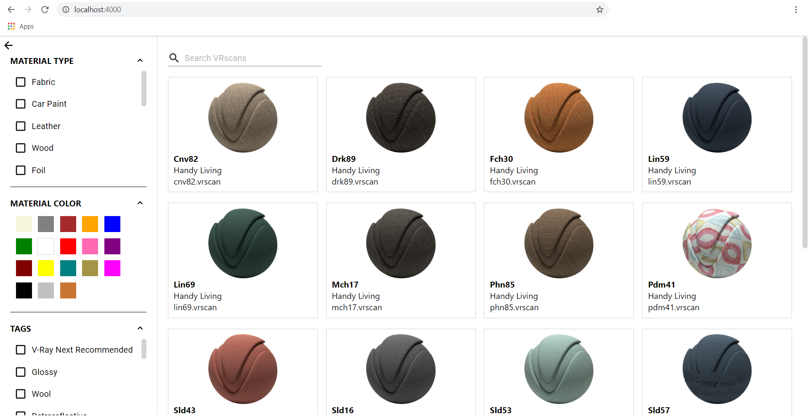
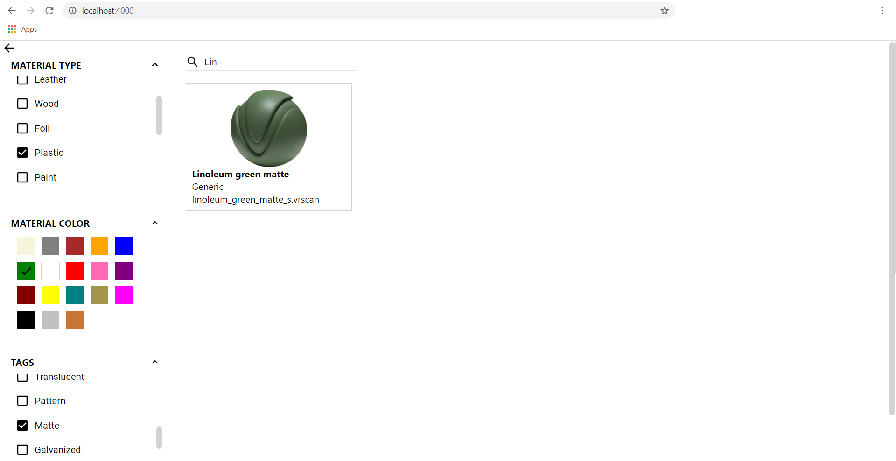

# Lazy-loading VRScans Library 

## Summary 

This project React-based load-on-demand library showing VRScans materials from a pre-defined REST API. Main screen is separated into two parts - filters section and materials section. Filter section contains - filter by material type, material color and tags. Materials sections contains all available materials. Each material is represented by name, filename, manifacture and thumbnail. For more details see the screenshots below.

### Main screen

### Main screen with applied filters

## API

This application uses json-server package to implement API endpoints.

### API Endpoints

 http://localhost:3000/vrscans – this is the main endpoint serving all VRScans materials, that need to be displayed in the library.

http://localhost:3000/materials – list of all available materials.

http://localhost:3000/colors – list of all available colors

http://localhost:3000/tags – list of all available tags

http://localhost:3000/manufacturers – list of all available manufacturers

## How to run the project

In the project directory, you can run:

### `npm start`

Runs the app in the development mode. 
Open [http://localhost:3000](http://localhost:3000) to view it in the browser.

The page will reload if you make edits. 
You will also see any lint errors in the console.

### `npm test`

Launches the test runner in the interactive watch mode. 
See the section about [running tests](https://facebook.github.io/create-react-app/docs/running-tests) for more information.

### `npm run build`

Builds the app for production to the `build` folder. 
It correctly bundles React in production mode and optimizes the build for the best performance.

The build is minified and the filenames include the hashes. 
Your app is ready to be deployed!

See the section about [deployment](https://facebook.github.io/create-react-app/docs/deployment) for more information.

